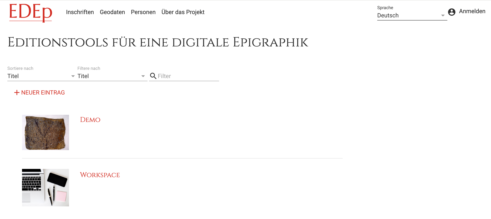
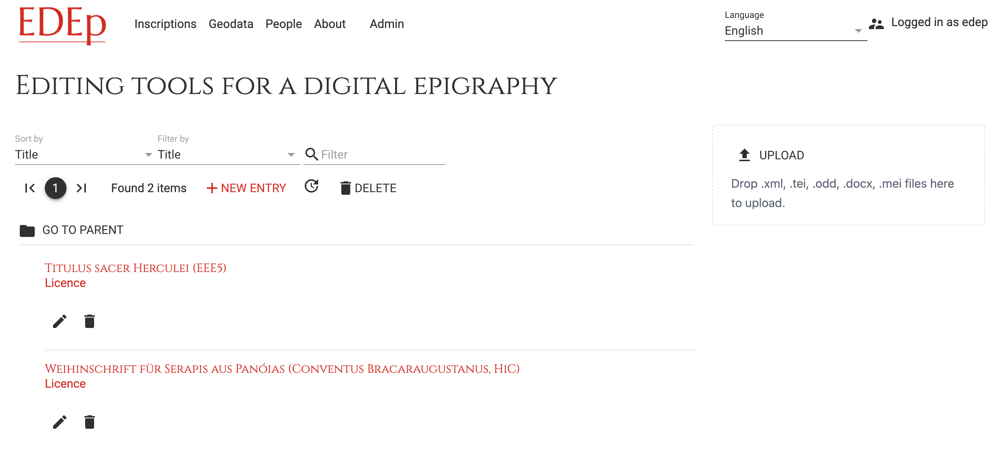

# Editing Tools for Digital Epigraphy

EDEp implements an editor and toolbox for epigraphic data adhering to the EpiDoc guidelines. Rather than developing yet another project-specific solution, our aim was to create a versatile toolbox, designed for customizability and extensibility. This repository contains the main application package. You may install and use it as is. However, it was designed to be modified, extended and adopted using the different parts of the toolbox. Those are in particular:

* a declarative forms framework in modern HTML, which operates on the actual TEI XML: no data mapping required
* web components for transcribing inscriptions using Leiden markup
* components allowing controlled XML editing for specific micro-environments within the larger form
* the TEI Processing Model for output transformations: rather than using hand-written transformations we describe them in a declarative way in TEI itself
* a component for looking up bibliographic references in Zotero

The current state of the application itself should be considered an **early beta**, i.e. fully usable, but still under development. The forms framework ([fore](https://jinntec.github.io/Fore/doc/index.html)) as well as the [web components](https://github.com/JinnElements/jinn-codemirror) for editing Leiden and XML are **production ready** and have already been tested extensively in other applications.

## Installation

You may either

1. install the application into an existing eXist instance or
2. use the docker image

Using option 1, the application requires at least Java version 8 and eXist version 6.2.0. Details of the installation process are described in the [TEI Publisher documentation](https://tei-publisher.com/exist/apps/tei-publisher/documentation/exist-installation). You may skip the last step: *Installing TEI Publisher*, which is not needed for EDEp, but open the dashboard as described. Next, download the EDEp application and data package from the [GitHub release page](https://github.com/eeditiones/edep/releases). Install those one after the other: either click on the *Upload* button and select the downloaded `edep-*.xar` or drag and drop it onto the button.

Option 2 is **recommended** for new users and easier if you would like a working environment without having to install Java and eXist. You need docker installed though. Windows and Mac users may download the [docker desktop](https://www.docker.com/products/docker-desktop) application. After install, open a shell and run the following pull command:

```sh
docker pull ghcr.io/eeditiones/edep:latest
```

Afterwards, either start a container from the image using the run command:

```sh
docker run -p 8080:8080 --name edep ghcr.io/eeditiones/edep:latest
```

Alternatively use docker desktop to launch a container, but remember to specify a port mapping for the 8080 port.

If everything went fine, the eXist database should be available on port 8080 and you can access its dashboard using the URL `http://localhost:8080/exist` in your browser.

## First Use

Once eXist is up and running, click on the *EDEp* application icon in the dashboard. The application should welcome you with the start page, showing two collections: *Demo* and *Workspace*.



*Demo* contains two inscriptions for demonstration purposes. New documents should be created in *Workspace*.

Log in by clicking the *login* button in the top right corner of the page. The default user is *edep* with password *edep*. After changing into the *Demo* collection, you'll see a list of documents. Clicking on the title of a document will bring you to the read-only view. To open the editor, click on the pencil icon below the document in the collection view.



## Customization

**Important note**: just like TEI, EpiDoc is **not** a standard in the sense that there's only one way to encode things. It does not strictly standardize every little detail, but rather tries to provide a common base. Many aspects depend on the concrete research object and will necessarily differ. Therefore you cannot expect that the editor will consume every possible variation of EpiDoc out of the box. It should handle the common denominator, i.e. common parts like titles, transcriptions, translations or commentaries, but may fail to correctly interpret other details of your encoding, which require further customization.

The editor is based on the forms framework [fore](https://jinntec.github.io/Fore/doc/index.html), which implements declarative user interfaces in plain HTML. The main editing form resides in [edit.html](src/templates/edit.html). This is an HTML5 file using so called *web components* for the form and some of the dynamic functionality. Web components are part of the W3C HTML5 standard and interpreted directly by the browser. They do not require any server-side processing.

Therefore the editor works entirely within the web browser: it only loads the EpiDoc XML upon start and submits it back to the server when you click save. As you edit any of the fields, the EpiDoc is constantly updated within the browser's memory to reflect the changes. Each form control is bound to a specific part or element of the EpiDoc, communicating any change back into the main XML document.

For example, the form field for the state of preservation is defined in the HTML as follows:

```html
<fx-control ref="physDesc/objectDesc/supportDesc/condition" update-event="input">
    <label>
        <pb-i18n key="form.preservation">Erhaltung</pb-i18n>
    </label>
    <select class="widget">
        <option value="" data-i18n="form.unknown">unbekannt</option>
        <option value="complete" data-i18n="preservation.complete">vollständig</option>
        <option value="fragmentary" data-i18n="preservation.fragmentary">fragmentarisch</option>
    </select>
</fx-control>
```

HTML elements starting with `fx-` belong to *Fore*, the forms framework. *Fore* was designed to preserve the good parts of the – now outdated – XForms standard and takes them to the next level. As with all powerful tools, it requires a bit of time to fully grasp the concepts and understand how they work together. We suggest to read the [article series](https://medium.com/@joern.turner/fore-elements-explained-part-1-89fc41ec6923), which explains the available elements.

The `@ref` attribute binds the form control to the element selected by the given XPath expression, in this case: `physDesc/objectDesc/supportDesc/condition` within the outer `msPart`. All labels are multi-lingual (German and English) by default, which is why we use the `<pb-i18n>` tag and `data-i18n` attributes to reference translation keys. Translations for all labels can be found in [src/resources/i18n/app](src/resources/i18n/app).

The design decision to use `msPart` was made to support inscriptions consisting of multiple fragments on the same object. EDEp therefore distinguishes between properties which apply to the object as a whole and those specific to the inscription. Consequently every EpiDoc document in EDEp has at least one `msPart` for the main inscription. Note however, that support for multiple fragments is still a bit lacking and needs more work.

When creating a new document, the editor starts by loading an empty [EpiDoc template](src/templates/fore/epidoc-template.xml). This contains placeholders for all the elements covered by the form. Some elements, e.g. bibliographic entries, are repeatable, which means you can add more of the same type. Sub-templates for those elements are mostly located in [templates.xml](src/templates/fore/templates.xml).

The form also needs some auxiliary data lists, e.g. for object types, materials and much more, which are mostly loaded from the data package.

To extend the form to include an additional element or attribute, one would proceed as follows:

1. edit [epidoc-template.xml](src/templates/fore/epidoc-template.xml) and add the missing element or attribute. If it should be part of an `msPart` (i.e. target the inscription), make sure to also modify [mspart-tmpl.xml](src/templates/fore/mspart-tmpl.xml) in the same way. If the element or attribute belongs to a repeatable section, check [templates.xml](src/templates/fore/templates.xml).
2. add a form control to [edit.html](src/templates/edit.html) and bind it to the element/attribute.

Many fields in the form may contain inline TEI/XML. We have thus developed an XML editor component (based on the excellent codemirror library), which can be plugged into the form to replace any plain-text input field:

```html
<fx-control class="commentary editor" ref="instance('default')//body/div[@type='commentary']" as="node" update-event="blur">
    <jinn-xml-editor id="commentary" class="widget" unwrap="unwrap" placeholder="[Inline text/markup or sequence of paragraphs]" schema="resources/scripts/tei.json" schema-root="div" namespace="http://www.tei-c.org/ns/1.0">
        <div slot="toolbar">
            <pb-popover>
                <iron-icon icon="info-outline"/>
                <template slot="alternate">
                    <pb-i18n key="form.hint-commentary">Hint</pb-i18n>
                </template>
            </pb-popover>
            <button data-command="selectElement" title="Select element around current cursor position">
                &lt;|&gt;
            </button>
            <button data-command="encloseWith" title="Enclose selection in new element">&lt;...&gt;
            </button>
            <button data-command="removeEnclosing" title="Remove enclosing tags" class="sep">&lt;X&gt;
            </button>
            <button data-command="snippet" data-params="&lt;p&gt;$|_|&lt;/p&gt;" title="Insert paragraph">&lt;p&gt;
            </button>
            <button data-command="snippet" data-params="&lt;ref type=&#34;biblio&#34; target=&#34;$|1|&#34;&gt;$|_|&lt;/ref&gt;" title="Insert reference">&lt;ref&gt;</button>
            <button data-command="snippet" data-params="&lt;persName key=&#34;$|1|&#34;&gt;$|_|&lt;/persName&gt;" title="persName"><iron-icon icon="social:person-add"></iron-icon></button>
            <button data-command="snippet" data-params="&lt;citedRange&gt;$|1|&lt;/citedRange&gt;" title="citedRange">&lt;citedRange&gt;</button>
        </div>
    </jinn-xml-editor>
</fx-control>
```

Important here is that the value returned by `jinn-xml-editor` will be an XML node rather than plain text. This has to be indicated via the `as="node"` attribute on `fx-control`. We also don't want to slow down editing by updating the EpiDoc with every key press, so the `update-event` is set to `blur`, which means updates will take place only after the user left the editing area.

The editor features context-sensitive suggestions for elements and attributes while typing. The schema used for suggestions is configured via `schema="resources/scripts/tei.json"` and has been auto-generated from the latest TEI P5 guidelines. One can limit the root element to start editing at via the `schema-root` attribute. In the example above, the root element being edited is a `div`.

### Treatment of empty elements/attributes

As explained above, the form works directly on the EpiDoc TEI XML. However, note that missing elements or attributes will be regarded as irrelevant by the form and the corresponding controls will be hidden. This is by design and conceptually an important feature! It is thus required that you **provide an empty placeholder** in the XML templates for every element or attribute to be edited in the form. For example, the template for the `<provenance>` element specifies empty attributes for `when` and `when-custom` even though those are mutually exclusive:

```xml
<provenance type="found" when="" when-custom="" notBefore="" notAfter="">
```

Also, because TEI does not allow empty attributes or elements in most places, a cleanup procedure is run on the resulting EpiDoc TEI before storing the edited document. In the reverse direction, i.e. when importing EpiDoc into the editor, empty elements/attributes will be re-inserted where necessary as given in the XML templates. This works automatically and should not need any customization, but if you encounter issues in this area, please report.